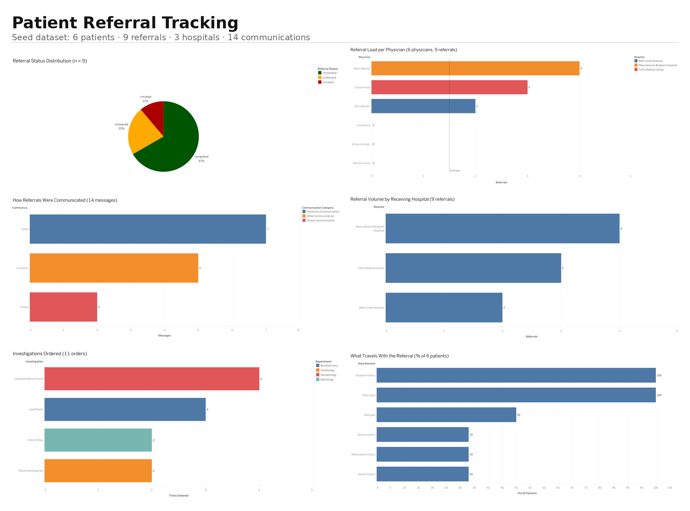
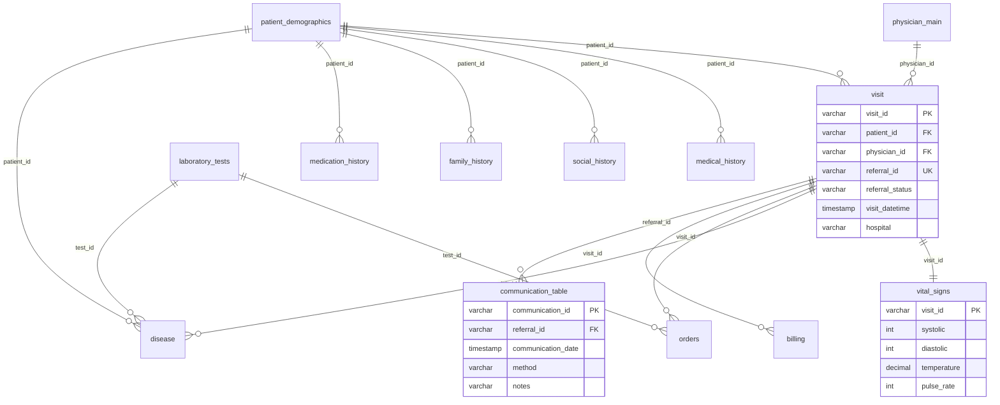
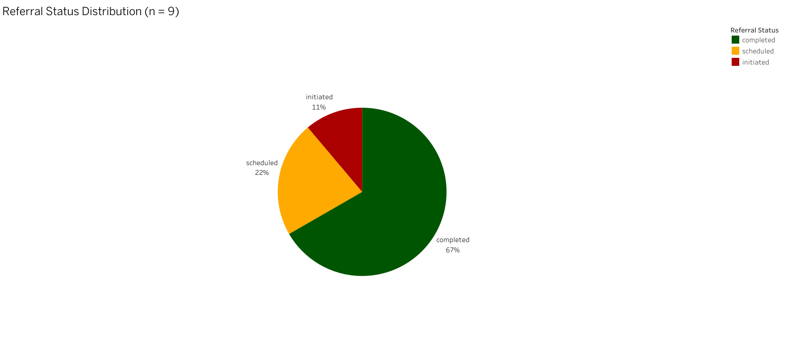
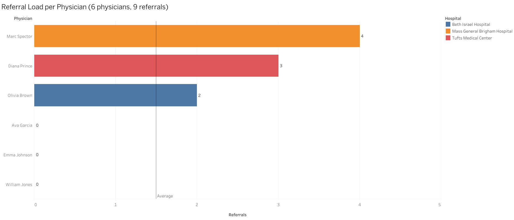
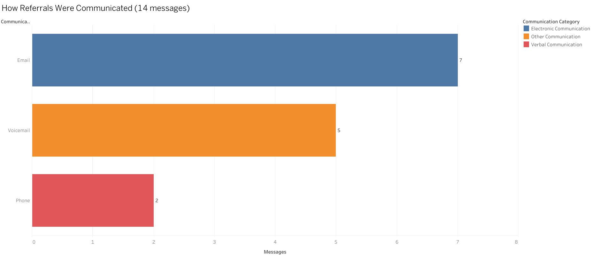
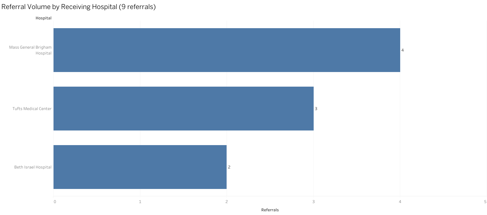
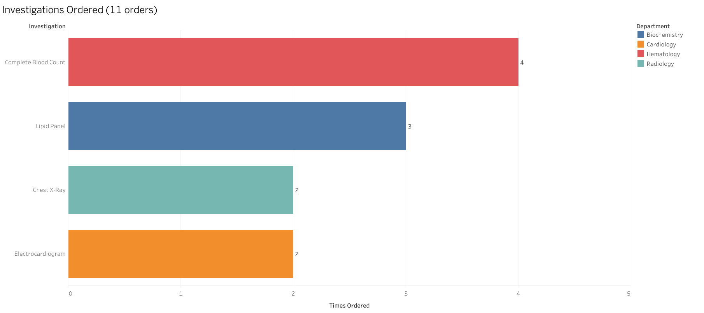
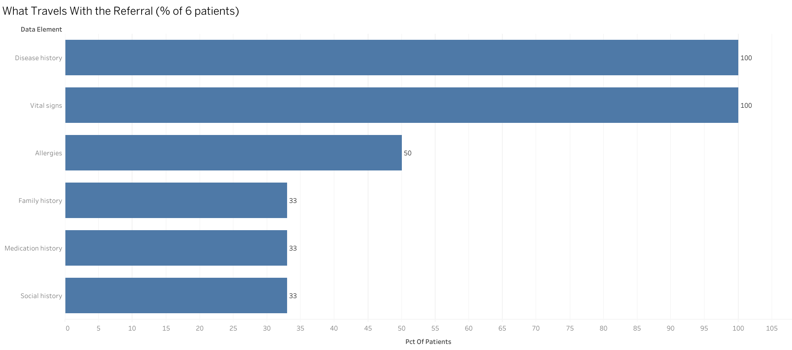

# Patient Referral Management Database

**A 13-table PostgreSQL schema for tracking specialty referrals between organizations, with nine reporting queries and a six-chart Tableau dashboard.**

Specialty referrals in the US break in two ways: they get lost, and they arrive empty. This project is a database design that addresses both — a visit-centred relational schema so the full clinical picture can travel with the referral, and a status-tracked referral entity so a stalled handoff becomes visible instead of silently disappearing.

| | |
|---|---|
| **Schema** | 13 tables — 3 reference, 1 hub (`visit`), 4 clinical, 4 patient background, 1 communication trail |
| **Database** | PostgreSQL 16 · pgAdmin 4 |
| **Analysis** | 9 reporting queries (`patient_referral_database.sql`, Section 3) |
| **Visualisation** | Tableau Public — 6 charts and a dashboard |
| **Dataset** | 6 patients · 9 referrals · 14 communications — a demonstration set, not a population sample |
| **Author** | Ajinkya (AJ) Kaduskar · [github.com/ajinkyakaduskar](https://github.com/ajinkyakaduskar) |

**[→ Full design walkthrough in `DESIGN.md`](DESIGN.md)** — the two problems, the HL7/interface-engine/HIE architecture the database sits on, a table-by-table breakdown, and one referral followed end to end.

---

## The two problems

**Referrals get lost.** A 2018 study of 103,737 appointment scheduling attempts across 24 primary-care sites found only **34.8%** resulted in a documented completed appointment. Not carelessness — no single system tracks the referral from end to end, so it falls into the gap between two organizations that don't talk.

**Referrals arrive empty.** A 2011 national survey of 4,720 physicians found a 34-point perception gap: **69% of primary-care physicians said they always or mostly sent patient history with a referral, while fewer than 35% of specialists said they always or mostly received it.**

The `referral_status` tracking on the `visit` table addresses the first. The schema — how the tables link — addresses the second.

---

## Schema

**The design principle is that the visit is the hub.** Everything clinical happens during a visit — vitals at a visit, diagnosis at a visit, orders at a visit, billing for a visit. Anchoring on the encounter is what lets a single query reach across the whole picture, and what lets the referral carry that picture with it instead of travelling alone.

Two columns carry the project: `referral_id` is the tracking number, `referral_status` is the state (`initiated` → `scheduled` → `completed`). `referral_id` is `UNIQUE` because `communication_table` references it with a foreign key, and a foreign key needs a guaranteed-unique target.

---

## The six charts

Chart type was chosen by the shape of the data. Every title carries its sample size, because at this scale the reader should never have to guess.

### 1 · Referral status distribution

Six of nine referrals completed, two scheduled, one still sitting at `initiated` — sent and never acted on. The only pie in the set: three slices, counts, summing to the whole.

### 2 · Referral load per physician

The chart that makes Q3's argument visible. Spector 4, Prince 3, Brown 2 — and **three physicians at zero**. Those three bars exist only because the query uses `LEFT JOIN`; switch it to `INNER JOIN` and they vanish from the result entirely. The average line sits at 1.5, which is exactly the threshold the `HAVING COUNT(...) < (SELECT AVG(...))` subquery computes.

### 3 · How referrals were communicated

Email 7, Voicemail 5, Phone 2. Half of all referral traffic rides on manual channels that a coordinator has to log by hand — and every manual step is a place data goes missing.

### 4 · Referral volume by receiving hospital

MGB 4, Tufts 3, Beth Israel 2. Note that Q8's percentage column sums to more than 100%: a patient referred to two hospitals counts once at each, so it measures *share of patients who touched each hospital*, not a partition of the population.

### 5 · Investigations ordered

CBC 4, Lipid Panel 3, ECG 2, Chest X-Ray 2 — the four-table join chain (patient → visit → orders → laboratory_tests) made visible.

### 6 · What travels with the referral

The chart the project is really about. Disease history and vitals are on 100% of patients; allergies on 50%; medication, social and family history on 33% each. The referral goes out carrying a diagnosis and a blood pressure, and leaves two-thirds of the patient's medication and social context behind. That is the empty-envelope problem in one picture.

---

## What this data can't tell you

- **Six patients is a demonstration set.** It exists to exercise the schema and prove the queries run correctly, not to support findings about referral behaviour. Every number above is a property of the seed data.
- **The fax/voicemail risk signal is not demonstrated here.** The literature argues referrals chased on manual channels stall more often. In *this* dataset, completed referrals split evenly between Email and Voicemail, and the single stalled referral was chased entirely by Email. The `method` field exists so the pattern *can* be measured at scale — it is not a finding from nine referrals.
- **Three queries return too few rows to chart.** Q2 (high-risk) returns one patient, Q6 (multi-specialty) returns one, Q5 returns five patients with identical counts. They're kept as SQL and result CSVs rather than forced into charts.

## What the schema doesn't model yet

`visit` carries one `hospital` column. A genuine cross-organization tracking record needs two — a referring organization and a receiving organization — plus a timestamp per status transition, so "days open" can be computed rather than inferred. As built, the schema tracks *that* a referral has a status; it doesn't model the handoff between two named parties or when each transition happened. That's the first thing a v2 adds.

Two flaws from the original build are already fixed here: identifiers are `VARCHAR` rather than `CHAR` (fixed-width padding is invisible inside Postgres but appears literally in CSV exports and chart labels), and blood pressure is stored as two integers rather than the text `'145/100'`, which is what makes the risk comparison in Q2 possible at all.

---

## Repository layout

All files sit at the repository root.

| Pattern | What it is |
|---|---|
| `README.md`, `DESIGN.md` | this page, and the full design walkthrough |
| `patient_referral_database.sql` | schema + seed data + 9 analysis queries + 6 chart queries |
| `q1_*.csv` … `q9_*.csv` | output of the nine analysis queries |
| `chart1_*.csv` … `chart6_*.csv` | the six chart inputs |
| `c1_*.png` … `c6_*.png`, `dashboard.png` | chart exports |
| `Chart N - *.twbx`, `Patient Referral Tracking Dashboard.twbx` | Tableau workbooks |

## Reproducing it

1. Create an empty PostgreSQL database.
2. Run `patient_referral_database.sql` top to bottom. It drops and recreates all 13 tables, so point it at a scratch database rather than anything live.
3. Section 3 holds the nine analysis queries; results should match the `q1`–`q9` CSVs.
4. Section 4 holds the six chart aggregations; results should match the `chart1`–`chart6` CSVs.
5. Open any `.twbx` workbook — the CSVs are packaged inside, so no path fixing is needed.

## Tools

PostgreSQL 16 · pgAdmin 4 · Tableau Public

## Sources

- [Closing the Referral Loop: an Analysis of Primary Care Referrals to Specialists in a Large Health System](https://link.springer.com/article/10.1007/s11606-018-4392-z) — *Journal of General Internal Medicine*, 2018
- O'Malley AS, Reschovsky JD. Referral and Consultation Communication Between Primary Care and Specialist Physicians — *Archives of Internal Medicine*, 2011 (n = 4,720)
- [Communication Gaps Persist Between Primary Care and Specialist Physicians](https://www.annfammed.org/content/20/4/343) — *Annals of Family Medicine*, 2022
